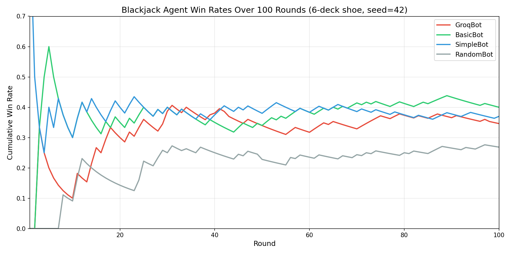

# Blackjack Agents

A framework for empirically testing blackjack strategies by simulating games with pluggable AI agents. Supports algorithmic strategies (basic strategy, card counting, simple heuristics) and LLM-powered agents (Claude, OpenAI, Groq) at the same table with reproducible card ordering.

## Sample Results

100 rounds, 6-deck shoe, 4 agents at the table:



| Agent | Strategy | Wins | Losses | Pushes | Win Rate | Net Units |
|---|---|---|---|---|---|---|
| BasicBot | Basic strategy chart | 40 | 50 | 10 | 40.0% | -9.5u |
| SimpleBot | Stand on 17+ | 37 | 54 | 9 | 37.0% | -15.0u |
| GroqBot | GPT-oss-20b (few-shot) | 36 | 59 | 9 | 34.6% | -16.5u |
| RandomBot | Uniform random | 29 | 75 | 4 | 26.9% | -49.0u |

The LLM agent plays above random but doesn't match the mathematically optimal basic strategy chart — the house always wins, but how much it wins varies significantly by strategy.

## Quick Start

```bash
pip install -e ".[dev]"

# Run an experiment
python -m blackjack_agents run configs/example_experiment.yaml

# With LLM agents (requires API key)
pip install -e ".[llm]"
export GROQ_API_KEY=your-key
python -m blackjack_agents run configs/groq_experiment.yaml
```

## Agents

- **RandomAgent** — uniform random from available actions (baseline)
- **SimpleAgent** — stand on 17+, hit below
- **BasicStrategyAgent** — full basic strategy lookup table
- **CardCountingAgent** — Hi-Lo system with Illustrious 18 deviations
- **GroqAgent** — LLM via Groq API with structured JSON output
- **ClaudeAgent** / **OpenAIAgent** — LLM via Anthropic / OpenAI APIs with tool use

## How It Works

Experiments are configured via YAML and use the [`blackjack21`](https://pypi.org/project/blackjack21/) library as the game engine. A custom `SeededShoe` injects a deterministically shuffled card sequence so the same shoe can be replayed across different strategy configurations. The shoe automatically reshuffles when it drops below 52 cards remaining, just like a real casino table using a cut card.

Each agent receives a `GameContext` snapshot (hand, dealer upcard, other players' visible cards, available actions) and returns a decision. LLM agents use few-shot prompting with structured outputs to guarantee valid responses.

Results are saved as JSON with full round-by-round records including every action taken, enabling detailed post-hoc analysis.
